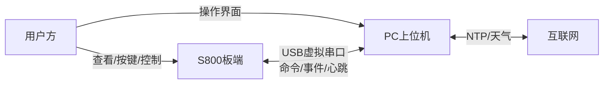

# S800 Three-Party Architecture

This directory contains a simplified three-party architecture diagram for the
S800 bidirectional collaborative multifunction digital clock.

- `architecture.svg`: directly viewable block diagram.
- `architecture.png`: PNG export of the architecture diagram.
- `architecture.jpg`: JPG export of the architecture diagram.
- `architecture.mmd`: Mermaid source for future edits.

## High-Level Flow

## Detailed Diagram

Open `docs/architecture.svg` in VSCode, a browser, or any SVG viewer.

The source Mermaid diagram is available in `docs/architecture.mmd`.
